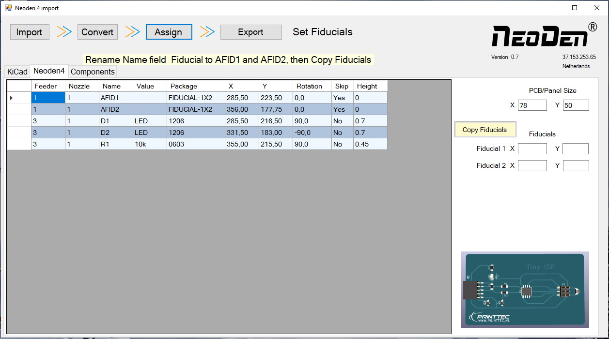

# Neoden 4 KiCad / Eagle converter.

This program will help you to convert the KiCad .pos or Eagle .mn? file to a CSV file that the Neoden 4 can use.
It will match the component with pre-defined feeder and nozzle types.

It is the easiest way to convert KiCad or Eagle files to Neoden 4.

For Eagle files use the mountsmd.ulp to generate the .mnt and the .mnb files.

In both Eagle and Kicad the left lower corner needs to be set to 0,0

##
This program will:

- Fix rotation.
- Set Feed position.
- Assign the correct Feeders and Nozzles.
- Configurate the Feeder options.
- Position the board on the conveyor.

To download the program use following link:

https://github.com/broedsels/Neoden4-KiCad-converter/archive/master.zip

## Getting Started

* Extract the file from the master.zip
* Execute the .msi file.

## Become a Patron!
Help me with a small contribution a month, so I can dedicate more time on programming and designing.
https://www.patreon.com/MyMakerspace
