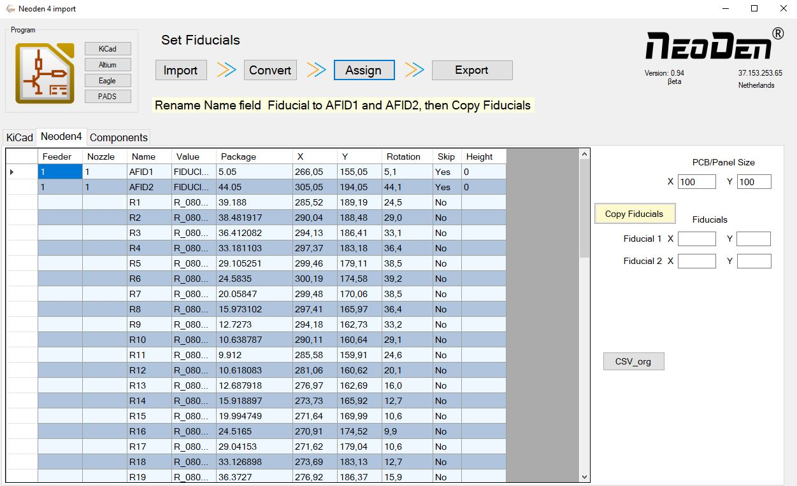
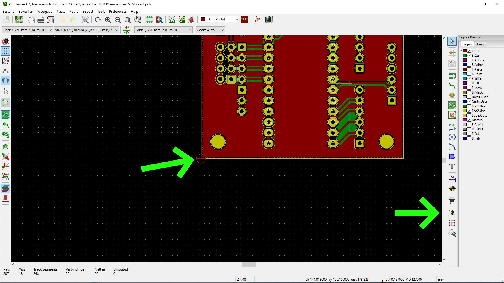
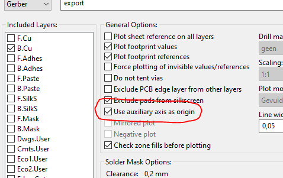
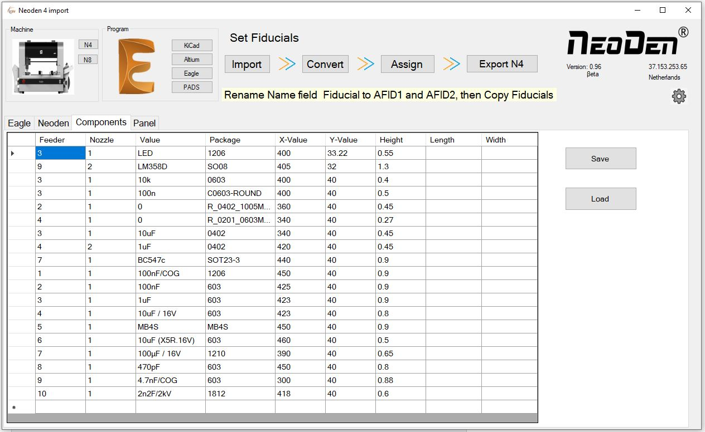

# CSV to Neoden4 file offline file converter.

## User PDF
https://docs.google.com/viewer?url=https://github.com/broedsels/CSV-to-Neoden4/blob/master/CSV%20to%20Neoden%20software.pdf

This program will help you to convert the Altium, Eagle, KiCad and PADS CSV file to a CSV file that the Neoden 4 can use.

It is the easiest way to generate a Neoden 4 CSV file.

For Eagle files use the mountsmd.ulp to generate the .mnt and the .mnb files.

Name the lower left fiducial AFID1 and the upper right fiducial AFID2.

The left lower left corner of the PCB needs to be set to 0,0

## Panel Builder.

From version 1.05 a basic panel builder is included.
The panel builder makes it possible to add the correct step and repeat and add this to the table.

## Component and feeder list.
Included a list to automaticly assign the feeders and nozzles.

##
This program will:

- Fix rotation.
- Set Feed position.
- Assign the correct Feeders and Nozzles.
- Configurate the Feeder options.
- Position the board on the conveyor.

## Download

See releases or download the program use following link:

https://github.com/broedsels/CSV-to-Neoden4/archive/master.zip

## Getting Started

* Unzip package
* Execute the .msi file.

